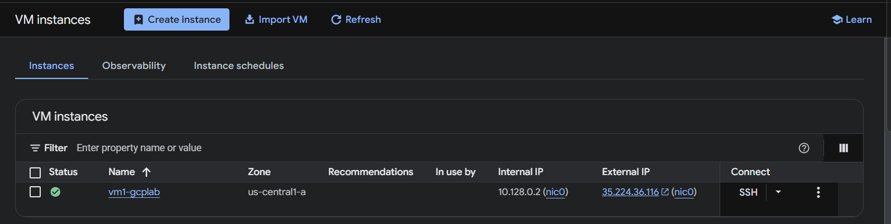
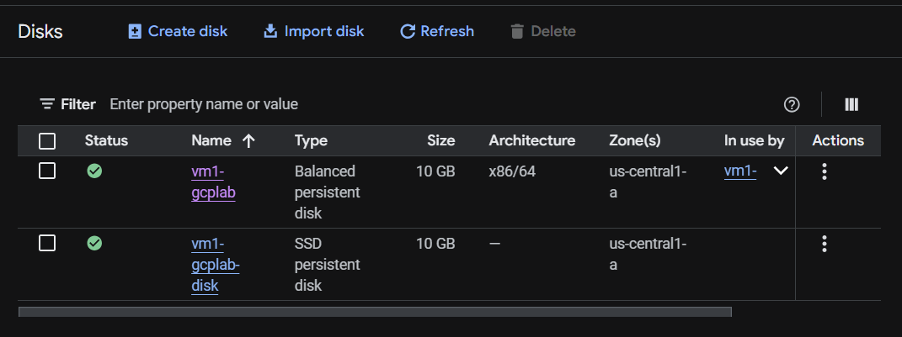
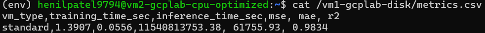
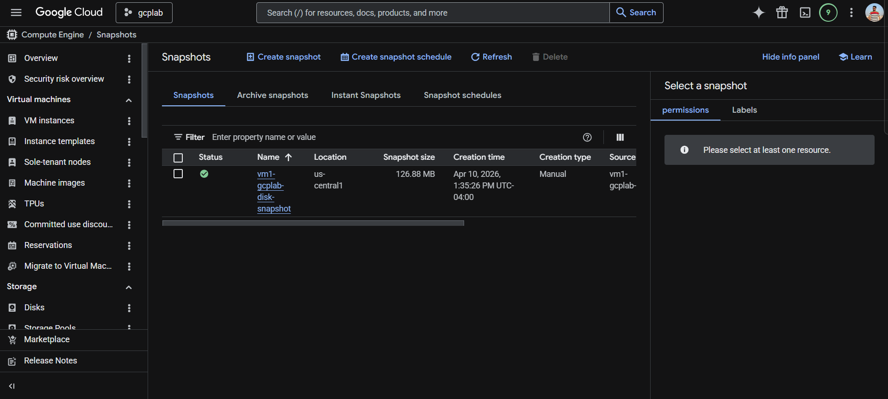
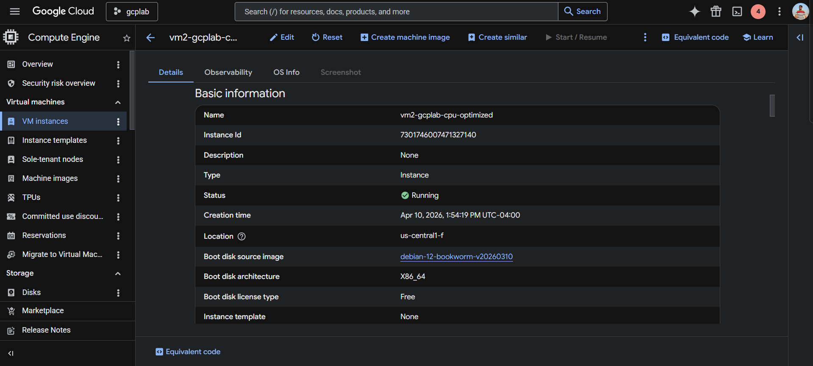
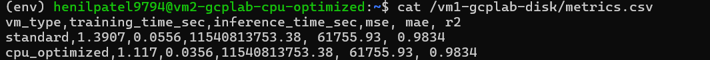

# GCP Compute Engine Lab — Car Price Prediction

## Overview

This lab demonstrates how to use **Google Cloud Platform (GCP) Compute Engine** to run a machine learning workload and compare performance across different virtual machine types.

The lab also covers key GCP infrastructure concepts including persistent disks, disk snapshots, SSH access, and file transfer between local and cloud machines.

---

## Objective

- Create and manage GCP Compute Engine VM instances via the Console UI
- Create, attach, format, and mount a persistent SSD disk
- Transfer files from a local machine to a GCP VM using SCP
- Train and evaluate a Random Forest Regressor model on car price data
- Log performance metrics (MSE, MAE, R2, training time, inference time) to a CSV file
- Take a disk snapshot as a backup before switching VMs
- Compare ML performance across a standard VM and a CPU-optimized VM

---

## Project Structure

```
GCP_Lab/
├── config.yaml                   # GCP project and VM configuration variables
├── create_vm.sh                  # Script to create a GCP VM instance
├── create_disk.sh                # Script to create a persistent SSD disk
├── attach_disk.sh                # Script to attach the disk to a VM
├── connect_to_vm.sh              # Script to SSH into a VM
├── install_dependencies.sh       # Script to set up Python env and install deps
├── carprice_dataset.csv          # Dataset
├── car_price_regressor.py        # ML training and evaluation script
├── requirements.txt              # Python dependencies
└── README.md                     # This file
```

## Lab Steps

### Part 1 — Local Machine Setup

#### Step 1.1 — Create Conda Environment
```bash
conda create -n gcp_lab python=3.10 -y
conda activate gcp_lab
```

#### Step 1.2 — Generate SSH Keys
```bash
ssh-keygen -t rsa -b 2048 -C "your_email@example.com"
```
Get your public key to add to GCP later:
```bash
cat ~/.ssh/id_rsa.pub
```

---

### Part 2 — Standard VM Setup (GCP Console)

#### Step 1 — Create the Standard VM
1. Go to **Compute Engine → VM instances → Create Instance**
2. Configure:
   - **Name:** `vm1-gcplab`
   - **Region:** `us-central1` / **Zone:** `us-central1-a`
   - **Series:** E2 → **Machine type:** Custom → 2 vCPU, 4 GB RAM
   - **Boot disk:** Default Debian 10 GB
3. Click **Create**



#### Step 2 — Create a 10GB SSD Persistent Disk
1. Go to **Compute Engine → Disks → Create Disk**
2. Configure:
   - **Name:** `vm1-gcplab-disk`
   - **Zone:** `us-central1-a` ← must match VM zone
   - **Disk type:** SSD persistent disk
   - **Size:** 10 GB
3. Click **Create**



> **Why a separate disk?** The persistent disk is independent of the VM. It can be detached and reattached to a different VM, which is exactly what this lab does — the same disk with the same data runs on both VMs.

#### Step 3 — Attach the Disk to the Standard VM
1. Go to **VM instances** → click `vm1-gcplab` → **Edit**
2. Scroll to **Additional disks** → **Attach existing disk**
3. Select `vm1-gcplab-disk` → **Save**
4. **Stop and Start the VM** so the disk registers

#### Step 4 — Add SSH Key to the VM
1. Click `vm1-gcplab` → **Edit** → scroll to **SSH Keys**
2. Click **+ Add item** → paste your public key → **Save**

#### Step 5 — SSH into the Standard VM
```bash
ssh -i ~/.ssh/id_rsa YOUR_USERNAME@EXTERNAL_IP
```

#### Step 6 — Format and Mount the Disk
```bash
# Verify disk is visible
lsblk

# Format the disk (ONLY do this once — never again on the second VM)
sudo mkfs.ext4 -F /dev/sdb

# Create mount directory and mount
sudo mkdir /vm1-gcplab-disk
sudo mount /dev/sdb /vm1-gcplab-disk
sudo chown $USER:$USER /vm1-gcplab-disk

# Verify
df -h | grep vm1-gcplab-disk
```

#### Step 7 — Copy Files to the VM (SCP)
Run this from your **local machine** in the parent folder of `GCP_Lab`:
```bash
# Windows PowerShell
scp -r -i ~/.ssh/id_rsa GCP_Lab YOUR_USERNAME@EXTERNAL_IP:/vm1-gcplab-disk

# Mac/Linux
scp -r -i ~/.ssh/id_rsa GCP_Lab username@EXTERNAL_IP:/vm1-gcplab-disk
```

Verify on the VM:
```bash
ls /vm1-gcplab-disk/GCP_Lab/
```

#### Step 8 — Install Dependencies and Run the Script
```bash
# Install Python and venv
sudo apt update -y
sudo apt install python3 python3-pip python3-venv -y

# Create virtual environment on the disk
python3 -m venv /vm1-gcplab-disk/env
source /vm1-gcplab-disk/env/bin/activate

# Install requirements
pip install -r /vm1-gcplab-disk/GCP_Lab/requirements.txt

# Set VM type label and run
export VM_TYPE="standard"
python3 /vm1-gcplab-disk/GCP_Lab/car_price_regressor.py
```

Verify metrics were saved:
```bash
cat /vm1-gcplab-disk/metrics.csv
```



---

### Part 3 — Disk Snapshot

#### Step 9 — Take a Snapshot Before Switching VMs
1. Go to **Compute Engine → Disks** → click `vm1-gcplab-disk`
2. Click **Create Snapshot**
3. Configure:
   - **Name:** `vm1-gcplab-disk-snapshot`
   - **Location:** Regional → `us-central1`
4. Click **Create**



> **Why snapshots?** A snapshot is a point-in-time backup of your disk. If anything goes wrong on the second VM, you can restore from this snapshot and recover your data and metrics.

#### Step 10 — Detach the Disk from the Standard VM
1. Click `vm1-gcplab` → **Edit** → scroll to **Additional disks**
2. Click **X** next to `vm1-gcplab-disk` → **Save**

#### Step 11 — Stop the Standard VM
1. Go to **VM instances** → check `vm1-gcplab` → click **Stop**

---

### Part 4 — CPU-Optimized VM

#### Step 12 — Create the CPU-Optimized VM
1. Go to **VM instances → Create Instance**
2. Configure:
   - **Name:** `vm2-gcplab-cpu-optimized`
   - **Region:** `us-central1` / **Zone:** `us-central1-a` ← must match disk zone
   - **Series:** C2D → **Machine type:** `c2d-highcpu-2` (2 vCPU, 4 GB)
3. Click **Create**



> **Why c2d-highcpu-2?** C2D machines use AMD EPYC processors with higher clock speeds, optimized for compute-intensive tasks like ML training. This is what makes the performance comparison meaningful.

#### Step 13 — Add SSH Key and Attach Disk
1. Click `vm2-gcplab-cpu-optimized` → **Edit**
2. Add your SSH public key under **SSH Keys**
3. Under **Additional disks** → **Attach existing disk** → select `vm1-gcplab-disk`
4. Click **Save**

#### Step 14 — SSH into the CPU-Optimized VM

If you get a host key warning (common when reusing the same IP):
```bash
ssh-keygen -R EXTERNAL_IP
```

Then connect:
```bash
ssh -i ~/.ssh/id_rsa YOUR_USERNAME@NEW_EXTERNAL_IP
```

#### Step 15 — Mount the Disk and Run the Script
```bash
# Mount the disk (DO NOT format again — data is already there)
sudo mkdir /vm1-gcplab-disk
sudo mount /dev/sdb /vm1-gcplab-disk
sudo chown $USER:$USER /vm1-gcplab-disk

# Verify files are still there
ls /vm1-gcplab-disk/GCP_Lab/
cat /vm1-gcplab-disk/metrics.csv

# Activate existing virtual environment
source /vm1-gcplab-disk/env/bin/activate

# Set VM type and run
export VM_TYPE="cpu_optimized"
python3 /vm1-gcplab-disk/GCP_Lab/car_price_regressor.py

# View final comparison
cat /vm1-gcplab-disk/metrics.csv
```



---

## Metrics Explained

| Metric | What it measures |
|---|---|
| **Training Time** | How long the model took to learn from the data |
| **Inference Time** | How long predictions took on the test set |
| **MSE** | Mean Squared Error — average of squared prediction errors |
| **MAE** | Mean Absolute Error — average absolute difference between predicted and actual price |
| **R2** | R Square - measures how well the model explains the variation in car prices compared to just predicting the average price every time |

---

## Key Concepts

**Persistent Disk** — A storage disk that exists independently of any VM. It can be detached from one VM and attached to another, making it ideal for carrying data across machines.

**Disk Snapshot** — A point-in-time backup of a persistent disk. Stored separately and can be used to restore data or create a new disk in a different zone.

**SCP** — A command-line tool to securely transfer files between your local machine and a remote server over SSH.

**Virtual Environment** — An isolated Python environment stored on the persistent disk so it can be reused on the second VM without reinstalling dependencies.